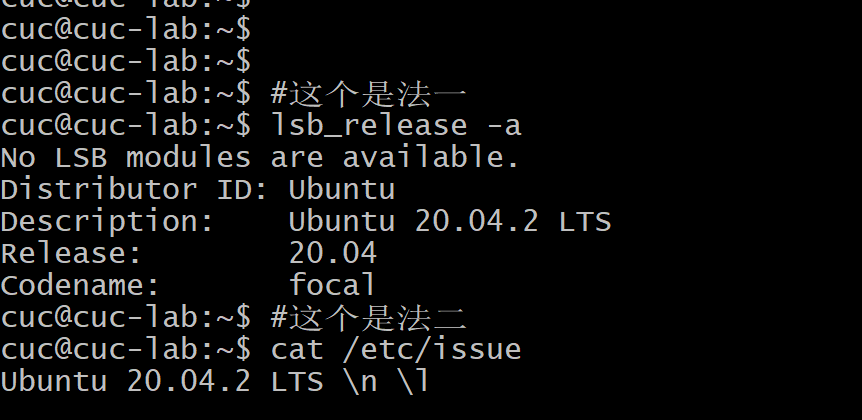
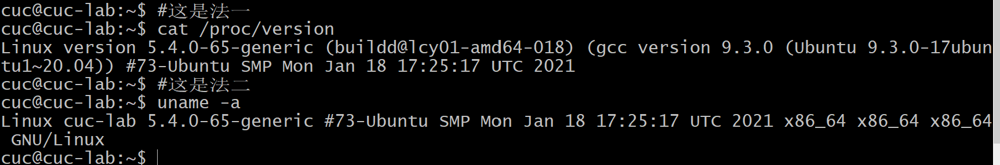
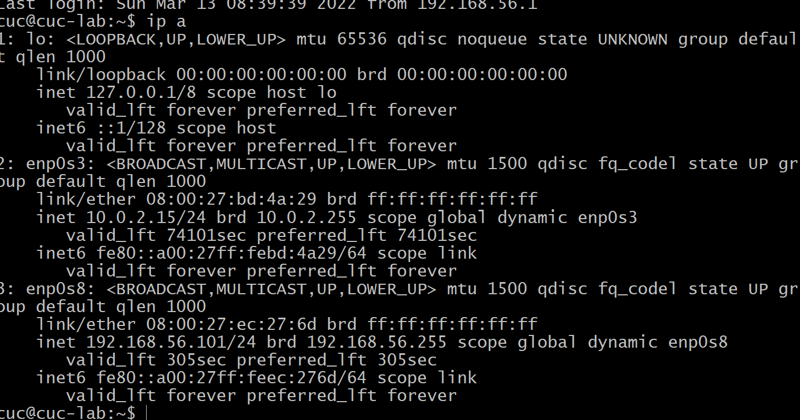
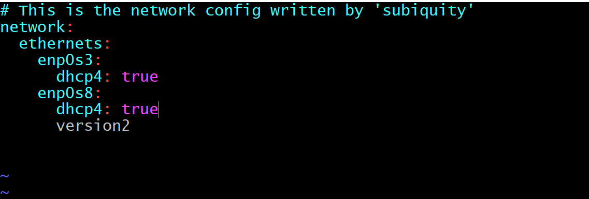
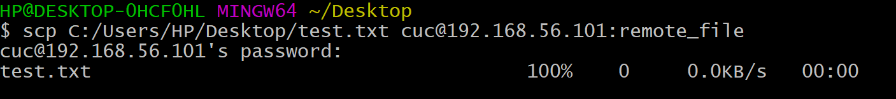
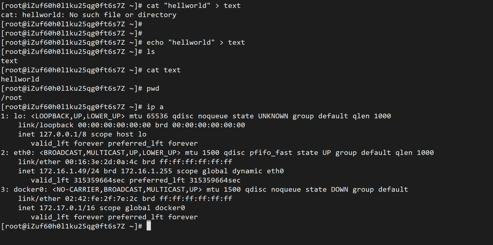
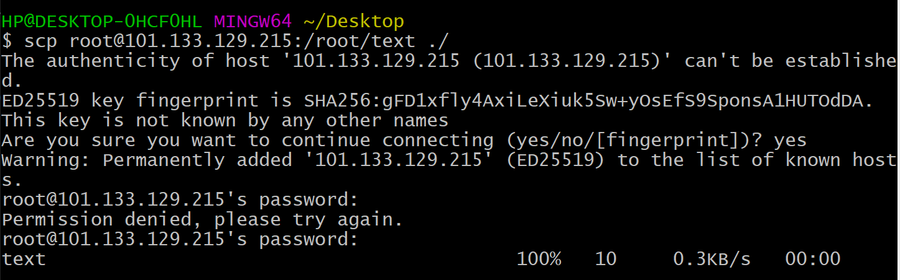
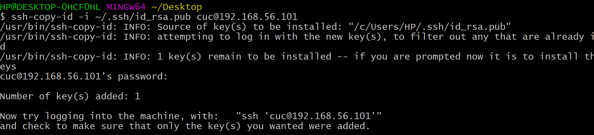
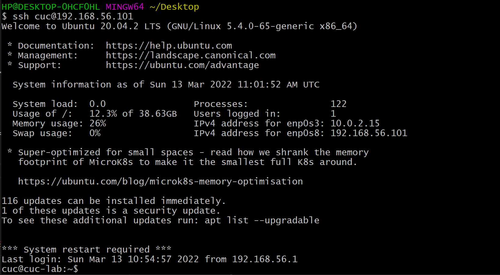

# 第一章：linux基础（实验）

## 一、实验环境

---

- 宿主机

  - Windows 10 专业版

- 虚拟机
  
  - Virtualbox 
    
  - Ubuntu 20.04 Server 64bit

- [阿里云云起实验室](https://developer.aliyun.com/adc/scenario/exp/a12055b0e9e84e5692b05ae25d377ec0)

---

## 二、实验问题

---

- 调查并记录实验环境的如下信息：

  - 当前 Linux 发行版基本信息
  - 当前 Linux 内核版本信息

- Virtualbox 安装完 Ubuntu 之后新添加的网卡如何实现系统开机自动启用和自动获取 IP？

- 如何使用 scp 在「虚拟机和宿主机之间」、「本机和远程 Linux 系统之间」传输文件？

- 如何配置 SSH 免密登录？

---

## 三、实验步骤

---

### 1、调查当前 Linux 发行版基本信息

---

以下代码可查看发行版名称、版本号、代号等信息

- 操作代码

``` 
lsb_release -a #法一
cat /etc/issue #法二
cat /etc/lsb-release  #法三
cat /etc/os-release  #法四
```

- 实验截图



---

### 2、调查当前 Linux 内核版基本信息

---

- 操作代码

```
cat /proc/version #法一
uname -a          #法二
```

- 实验截图



从实验截图可知当前所用Ubuntu20.04的内核版本为：5.4.0-65-generic

---

### 3、Virtualbox 安装完 Ubuntu 之后新添加的网卡实现系统开机自动启用和自动获取 IP

---
- 先查看目前网卡的使用情况

```
ip a
```


- 手动配置地址并生效

``` 
sudo vim /etc/netplan/00-installer-config.yaml
sudo netplan apply

```


如果看到网卡enp0s3下面有参数dhcp4: true，说明该网卡开启了dhch地址分配

---

### 4、使用 scp 在「虚拟机和宿主机之间」、「本机和远程 Linux 系统之间」传输文件？

---

- 虚拟机和宿主机之间

1. 先在桌面上建立一个text.txt，然后用以下代码复制到虚拟机

```
C:/Users/hp/Desktop/test.txt cuc@192.168.56101:remote_file
```

2. 传输完成后会显示如下



- 本机和远程 Linux 系统之间

1. 在阿里云的实验环境中创建资源，我们在该环境的根目录下创建一个
test文件，这里顺便总结以下要用到的linux的常用命令：
ls会列举出当前工作目录的内容（文件或文件夹）；
pwd(Print Working Directory)显示当前工作目录；
cat 用于在标准输出（监控器或屏幕）上查看文件内容。

    - 代码如下：
    ```
    echo "hellworld" > text
    ls
    cat text
    pwd
    ```
    - 实验截图：
  

2. 将远程linux系统的文件传输的本地

- 代码如下：
  ```
  scp root@101.133.129.215:/root/text ./
  ```

- 实验截图


--- 

### 5、配置 SSH 免密登录

---

- 可以通过使用 ssh-keygen 命令来生成密钥，通过执行命令 ssh-keygen -t rsa 来生成我们需要的密钥，执行上面的命令时，我们直接按三次回车，之后会在用户的根目录下生成一个 .ssh 的文件夹
  - 代码如下：
  ```
  ssh-keygen -t rsa
  ```
  - 实验截图：
  

- 配置免密登录
  - 代码如下：
  ```
  ssh-copy-id -i ~/.ssh/id_rsa.pub cuc@192.168.56.101
  ```

  - 实验截图：
  

- 免密登录验证


---

## 四、我遇到的问题


- 对发行版和内核版的概念模糊。

  简言之Linux发行版是一个可以高效使用Linux内核的操作系统，即它涵盖了Linux内核，此外还包含一些GNU程序库和工具等等。

  [内核版本与发行版本（CentOS & Ubuntu）的对应关系](https://blog.csdn.net/zhaihaibo168/article/details/102673669)

- 不知道如何进行分支操作，对如何提交作业也存在问题，对github的使用非常陌生

  github的分支操作可参考黄老师的b站视频：[github分支操作](https://www.bilibili.com/video/BV1Hb4y1R7FE?p=30)

  github的使用可参考kiteAB的B站视频：[github使用](https://www.bilibili.com/video/BV1yo4y1d7UK?spm_id_from=333.337.search-card.all.click)

- 使用scp在虚拟机和宿主机之间传输文件时存在疑惑

  参考博主pan-zy的文章


---

## 五、参考文献

---

- [Linux常用命令](https://www.jianshu.com/p/0056d671ea6d)

- [Linux下查看系统版本号和内核信息的方法](https://blog.csdn.net/huoyuanshen/article/details/52870740)

- [内核版本与发行版本（CentOS & Ubuntu）的对应关系](https://blog.csdn.net/zhaihaibo168/article/details/102673669)

- [ssh免密登录](https://www.cnblogs.com/hanwen1014/p/9048717.html)

- [关于自动启用并获取ip的相关知识](https://blog.csdn.net/xiongyangg/article/details/110206220)