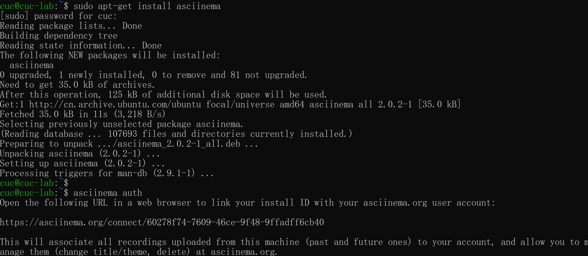
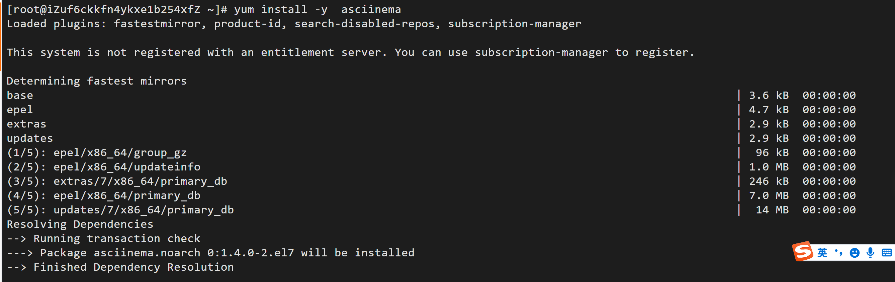

# 第二章：linux服务器系统使用基础（实验）

---

## 一、实验环境

---

- VirtualBox 6.1

- Ubuntu 20.04.02 Server 64bit

- [阿里云云起实验室](https://developer.aliyun.com/adc/scenario/exp/a12055b0e9e84e5692b05ae25d377ec0)


- [asciinema](https://asciinema.org/) 

---

## 二、实验问题

---

- 使用表格方式记录至少 2 个不同 Linux 发行版本上以下信息的获取方法，使用 [asciinema](https://asciinema.org/) 录屏方式「分段」记录相关信息的获取过程和结果

- 【软件包管理】在目标发行版上安装` tmux `和 `tshark` ；查看这 2 个软件被安装到哪些路径；卸载 `tshark` ；验证` tshark` 卸载结果

- 【文件管理】复制以下代码到终端运行，在目标 Linux 发行版系统中构造测试数据集，然后回答以下问题：

   ```
    cd /tmp && for i in $(seq 0 1024);do dir="test-$RANDOM";mkdir "$dir";echo "$RANDOM" > "$dir/$dir-$RANDOM";done
   ```

  - 找到 `/tmp` 目录及其所有子目录下，文件名包含 `666` 的所有文件
  - 找到 `/tmp` 目录及其所有子目录下，文件内容包含 `666` 的所有文件

- 【文件压缩与解压缩】练习课件中 [文件压缩与解压缩](https://c4pr1c3.github.io/LinuxSysAdmin/chap0x02.md.html#/12/1) 一节所有提到的压缩与解压缩命令的使用方法

- 【跟练】 [子进程管理实验](https://asciinema.org/a/f3ux5ogwbxwo2q0wxxd0hmn54)

- 【硬件信息获取】目标系统的 CPU、内存大小、硬盘数量与硬盘容量

---

## 三、实验步骤

---

### 1、在 asciinema 注册一个账号，并在本地安装配置好asciinema

---

- ubuntu20.04上实验

配置代码：

```
sudo apt-add-repository ppa:zanchey/asciinema
sudo apt-get update
sudo apt-get install asciinema
asciinema auth
```
实验截图：



- 阿里云平台（CentOS）上实验

配置代码：

```
yum install -y  asciinema
asciinema auth
asciinema rec
```

实验截图：


---

### 2、【软件包管理】在目标发行版上安装` tmux `和 `tshark` ；查看这 2 个软件被安装到哪些路径；卸载 `tshark` ；验证` tshark` 卸载结果

---

- Ubuntu20.04上实验

实验代码：

```
sudo apt install tmux #安装tmux
which tmux #查看tmux安装路径
sudo apt-get install tshark #安装tshark
which tshark	#查看tshark安装路径
sudo apt-get remove --purge tshark # 卸载tshark软件包
```

安装并查看`tmux`：

[](https://asciinema.org/a/pgI4Kupciu2otAxs0FocuFeB8)

安装查看卸载`tshark`:

[](https://asciinema.org/a/CzaFLbInwYzYvzRtaylkOvxHq)

- 阿里云平台（CentOS）上实验

实验代码：
```
yum install tmux
which tmux
yum install wireshark
which tshark
yum -y remove wireshark
which tshark
```

实验过程：

[](https://asciinema.org/a/zOKb3wFSeToGnijQDoXsBeRW1)


---

### 3、【文件管理】复制以下代码到终端运行，在目标 Linux 发行版系统中构造测试数据集，然后回答以下问题：

   ```
    cd /tmp && for i in $(seq 0 1024);do dir="test-$RANDOM";mkdir "$dir";echo "$RANDOM" > "$dir/$dir-$RANDOM";done
   ```

  - 找到 `/tmp` 目录及其所有子目录下，文件名包含 `666` 的所有文件
  - 找到 `/tmp` 目录及其所有子目录下，文件内容包含 `666` 的所有文件

---

- Ubuntu20.04上实验

实验代码：
```
sudo find ./ -type f -name "*666*"  #找到 `/tmp` 目录及其所有子目录下，文件名包含 `666` 的所有文件

grep -r "666" ./  #找到 `/tmp` 目录及其所有子目录下，文件内容包含 `666` 的所有文件

```
实验过程：

[](https://asciinema.org/a/Zd8OnNXdZN6rauVfl5L0MUQsv)

- 阿里云平台（CentOS）上实验

实验代码：
```
cd /tmp && for i in $(seq 0 1024);do dir="test-$RANDOM";mkdir "$dir";echo "$RANDOM" > "$dir/$dir-$RANDOM";done

cd /tmp

sudo find ./ -name '*666*'

sudo grep -r '666' ./
```

实验过程：

[](https://asciinema.org/a/KWlrzxabnjeUlac8gHyzrwBM0)

---

### 4、【文件压缩与解压缩】练习课件中 [文件压缩与解压缩](https://c4pr1c3.github.io/LinuxSysAdmin/chap0x02.md.html#/12/1) 一节所有提到的压缩与解压缩命令的使用方法

---

- Ubuntu20.04上实验

实验代码：

```
#创建文件

# gzip:

gzip test.txt 
gzip -d test.txt.gz

# bzip2

bzip2 -z test.txt
bzip2 -d test.txt.bz2

# zip

zip test.txt.zip /tmp
unzip test.txt.zip

# tar

tar -czvf test.tar test.txt
tar -xzvf test.tar

# 7z

7za a test.7z /test.txt
7za x test.7z
```

实验过程：

[](https://asciinema.org/a/LprKVq3TShv6fRCrLXhou8eYV)

- 阿里云平台（CentOS）上实验

实验代码：
```
# gzip:

gzip test.txt 
gzip -d test.txt.gz

# bzip2

bzip2 -z test.txt
bzip2 -d test.txt.bz2

# zip

zip test.txt.zip /tmp
unzip test.txt.zip

# tar

tar -czvf test.tar test.txt
tar -xzvf test.tar

# 7z

7za a test.7z /test.txt
7za x test.7z
```

实验过程：

[](https://asciinema.org/a/yuO1aYRPIbno1tjet6rj0lb2b)

--- 

### 5、【跟练】 [子进程管理实验](https://asciinema.org/a/f3ux5ogwbxwo2q0wxxd0hmn54)

---

- Ubuntu20.04上实验

[](https://asciinema.org/a/5GhiFNatZviWJ17B4G9PZr5kd)

- 阿里云平台（CentOS）上实验

[](https://asciinema.org/a/EUptPyZCvJZiFQx9yNBnqTwst)

--- 


### 6、【硬件信息获取】目标系统的 CPU、内存大小、硬盘数量与硬盘容量

---

- Ubuntu20.04上实验

实验代码：
```
cat /proc/cpuinfo  # 获取CPU信息
free -h #获取内存信息 
df -h #获取硬盘数量以及容量信息
```

实验过程：

[](https://asciinema.org/a/3AFoQm2QCNXx4t45DVye7ddwl)

- 阿里云平台（CentOS）上实验

实验代码：
```
cat /proc/cpuinfo  # 获取CPU信息
free -h #获取内存信息 
df -h #获取硬盘数量以及容量信息
```

实验过程：

[](https://asciinema.org/a/Q1Nq15BbuVuItFtNkTBqo7ESW)

---

### 7、使用表格方式记录至少 2 个不同 Linux 发行版本上以上信息的获取方法

---
|       版本号       | ubuntu 20.04 | CentOS 7.7 |
| :---------------: | :----------: |   :----:         |
|        安装        |     sudo apt install XXX         | yum install xxx |
|      安装路径      | which XXX | which xxx |
|        卸载        | sudo apt-get remove --purge XXX | yum -y remove xxx |
| 找特定文件名的文件 | sudo find ./ -name '*XXX*' | sudo find ./ -name '*XXX* |
|  找特定内容的文件  | sudo grep -r 'XXX' ./ | sudo grep -r 'XXX' ./ |
|     gzip的压缩与解压缩     |     `gzip test.txt` and `gzip -d test.txt.gz`     |    `gzip test.txt` and `gzip -d test.txt.gz` |
| bzip2的压缩与解压缩|`bzip2 -z test.txt`and`bzip2 -d test.txt.bz2`|`bzip2 -z test.txt`and`bzip2 -d test.txt.bz2`|
|zip的压缩与解压缩|`zip test.txt.zip /tmp`and`unzip test.txt.zip`|`zip test.txt.zip /tmp`and`unzip test.txt.zip`|
|tar的压缩与解压缩|`tar -czvf test.tar test.txt`and`tar -xzvf test.tar`|`tar -czvf test.tar test.txt`and`tar -xzvf test.tar`|
|7z的压缩与解压缩|`7za a test.7z /test.txt`and`7za x test.7z`|`7za a test.7z /test.txt`and`7za x test.7z`|
|    CPU信息获取     | cat /proc/cpuinfo | cat /proc/cpuinfo |
|      内存大小      | free -h | free -h |
|      硬盘数量以及容量      | df -h/ lsblk | df -h/ lsblk |


---

## 四、我遇到的问题

---
- 阿里云平台提供的虚拟环境CentOS7.7.1908在安装包管理和查找文件方面与Ubuntu20.04不同。

  查阅CentOS7的官方文档和博客

- 在CentOS7平台安装tshark软件包时发现没有该软件包。

  该发行版下tshark包包含在Wireshark内，所以只要安装Wireshark即可。

- ssh: Could not resolve hostname c: Name or service not known

- 在centos7.7上使用7za是要先安装7zip

  安装命令：yum install -y p7zip
---

## 五、参考文献

---

- [linux服务器系统使用基础](https://c4pr1c3.github.io/LinuxSysAdmin/chap0x02.md.html#/3/3)

- [linux文件与目录管理](https://www.runoob.com/linux/linux-file-content-manage.html)

- [grep命令](https://www.runoob.com/linux/linux-comm-grep.html)

- [文件的压缩与解压缩](https://zhuanlan.zhihu.com/p/152623706)

- [硬件信息获取](https://blog.csdn.net/JineD/article/details/107611133)

- [centos安装p7zip](https://blog.csdn.net/weixin_33824363/article/details/92662856)