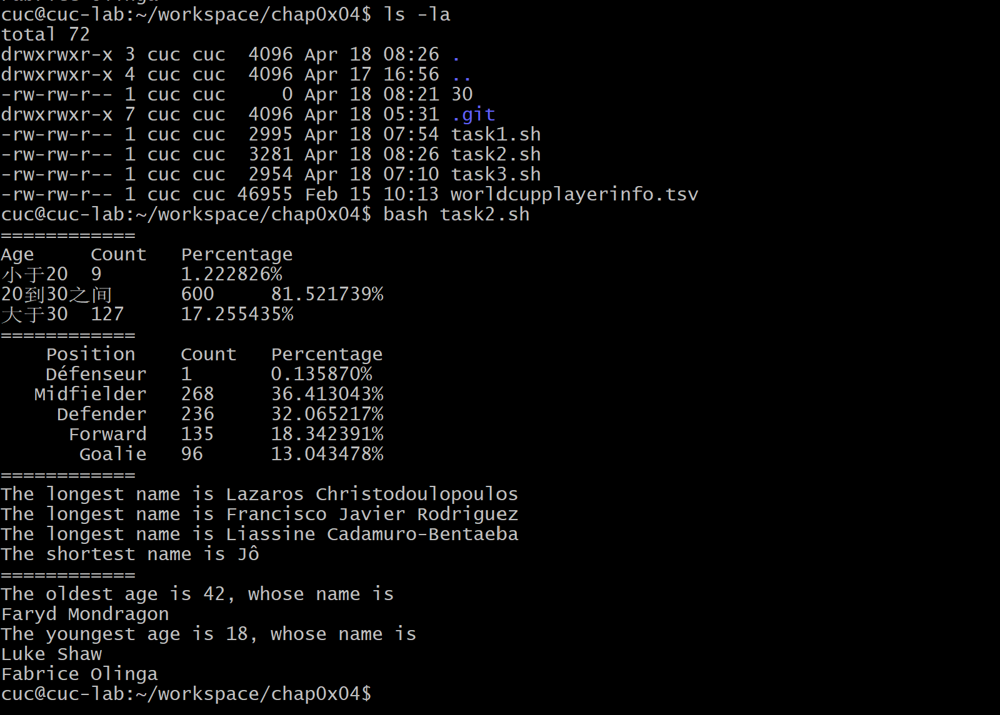

# 实验四：shell脚本编程基础（实验）

---

## 实验环境

---
- VirtualBox 6.1
- Ubuntu 20.04.02 Server 64bit
- Travis CI
- VsCode（已安装相应环境依赖）

---

## 实验内容

---

任务一：用bash编写一个图片批处理脚本，实现以下功能：
- 支持命令行参数方式使用不同功能
- 支持对指定目录下所有支持格式的图片文件进行批处理
- 支持以下常见图片批处理功能的单独使用或组合使用
  - ☑️ 支持对jpeg格式图片进行图片质量压缩
  - ☑️支持对jpeg/png/svg格式图片在保持原始宽高比的前提下压缩分辨率
  - ☑️支持对图片批量添加自定义文本水印
  - ☑️支持批量重命名（统一添加文件名前缀或后缀，不影响原始文件扩展名）
  - ☑️支持将png/svg图片统一转换为jpg格式图片  

任务二：用bash编写一个文本批处理脚本，对以下附件分别进行批量处理完成相应的数据统计任务：
- 2014世界杯运动员数据
  - ☑️统计不同年龄区间范围（20岁以下、[20-30]、30岁以上）的球员数量、百分比
  - ☑️统计不同场上位置的球员数量、百分比
  - ☑️名字最长的球员是谁？名字最短的球员是谁？
  - ☑️年龄最大的球员是谁？年龄最小的球员是谁？  

任务三：用bash编写一个文本批处理脚本，对以下附件分别进行批量处理完成相应的数据统计任务：
- Web服务器访问日志
  - ☑️统计访问来源主机TOP 100和分别对应出现的总次数
  - ☑️统计访问来源主机TOP 100 IP和分别对应出现的总次数
  - ☑️统计最频繁被访问的URL TOP 100
  - ☑️统计不同响应状态码的出现次数和对应百分比
  - ☑️分别统计不同4XX状态码对应的TOP 10 URL和对应出现的总次数
  - ☑️给定URL输出TOP 100访问来源主机

---

## 实验报告要求

---
- 继承以往的所有实验报告要求
- 上述任务的所有源代码文件必须单独提交并提供详细的–help脚本内置帮助信息
- 任务二和任务三的所有统计数据结果要求写入独立实验报告

---

## 实验步骤

---
### 任务一：
- 安装`imagemagick`和`shellcheck`，并用上传满足格式的图片文件
```
sudo apt-get update
sudo apt-get install shellcheck
sudo apt-get install imagemagick
```
- 支持对jpeg格式图片进行图片质量压缩
```
function task1-1 {
    Q=$1 # 质量因子
    for i in *;do
        type=${i##*.} # 删除最后一个.及左边全部字符
        if [[ ${type} != "jpeg" ]]; then continue; fi;
        convert "${i}" -quality "${Q}" "${i}"
        echo "${i} is compressed."
    done
}
```
- 对jpeg/png/svg格式图片在保持原始宽高比的前提下压缩分辨率
```
function task1-2 {
    R=$1
    for i in *;do
        type=${i##*.}
        if [[ ${type} != "jpeg" && ${type} != "png" && ${type} != "svg" ]]; then continue; fi;
        convert "${i}" -resize "${R}" "${i}"
        echo "${i} is resized."
    done
}
```
- 对图片批量添加自定义文本水印
```
function task1-3 {
    for i in *;do
        type=${i##*.}
        if [[ ${type} != "jpeg" && ${type} != "png" && ${type} != "svg" ]]; then continue; fi;
        convert "${i}" -pointsize "$1" -fill black -gravity center -draw "text 10,10 '$2'" "${i}"
        echo "${i} is watermarked with $2."
    done
}
```
- 批量重命名（统一添加文件名前缀或后缀，不影响原始文件扩展名）
```
# 前缀
function prefix {
    for i in *;do
        type=${i##*.}
        if [[ ${type} != "jpeg" && ${type} != "png" && ${type} != "svg" ]]; then continue; fi;
        mv "${i}" "$1""${i}"
        echo "${i} is renamed to $1${i}"
    done
}
# 后缀
function suffix {
    for i in *;do
        type=${i##*.}
        if [[ ${type} != "jpeg" && ${type} != "png" && ${type} != "svg" ]]; then continue; fi;
        filename=${i%.*}$1"."${type}
        mv "${i}" "${filename}"
        echo "${i} is renamed to ${filename}"
    done
}
```
- 将png/svg图片统一转换为jpg格式图片
```
function task1-5 {
    for i in *;do
        type=${i##*.}
        if [[ ${type} != "png" && ${type} != "svg" ]]; then continue; fi;
        filename=${i%.*}".jpg"
        convert "${i}" "${filename}"
   	echo "${i} is transformed to ${filename}"
    done
}
```

### 任务二
- 先下载tsv文件
```
wget "https://c4pr1c3.gitee.io/linuxsysadmin/exp/chap0x04/worldcupplayerinfo.tsv"
```
- 统计不同年龄区间范围（20岁以下、20到30之间、30岁以上）的球员数量、百分比
```
function task2-1 {
    awk -F "\t" '
        BEGIN {a=0; b=0; c=0;}
        $6!="Age" {
            if($6>=0&&$6<20) {a++;}
            else if($6<=30) {b++;}
            else {c++;}
        }
        END {
            sum=a+b+c;
            printf("Age\tCount\tPercentage\n");
            printf("<20\t%d\t%f%%\n",a,a*100.0/sum);
            printf("[20,30]\t%d\t%f%%\n",b,b*100.0/sum);
            printf(">30\t%d\t%f%%\n",c,c*100.0/sum);
        }' worldcupplayerinfo.tsv
}
```
- 统计不同场上位置的球员数量、百分比
```
function task2-2 {
    awk -F "\t" '
        BEGIN {sum=0}
        $5!="Position" {
            pos[$5]++;
            sum++;
        }
        END {
            printf("    Position\tCount\tPercentage\n");
            for(i in pos) {
                printf("%13s\t%d\t%f%%\n",i,pos[i],pos[i]*100.0/sum);
            }
        }' worldcupplayerinfo.tsv
}
```
- 名字最长的球员是谁？名字最短的球员是谁？
```
function task2-3 {
    awk -F "\t" '
        BEGIN {max=-1; min=1000;}
        $9!="Player" {
            len=length($9);
            names[$9]=len;
            max=len>max?len:max;
            min=len<min?len:min;
        }
        END {
            for(i in names) {
                if(names[i]==max) {
                    printf("The longest name is %s\n", i);
                } else  if(names[i]==min) {
                    printf("The shortest name is %s\n", i);
                }
            }
        }' worldcupplayerinfo.tsv
}
```
- 年龄最大的球员是谁？年龄最小的球员是谁？
```
function task2-4 {
    awk -F "\t" '
        BEGIN {max=-1; min=1000;}
        NR>1 {
            age=$6;
            names[$9]=age;
            max=age>max?age:max;
            min=age<min?age:min;
        }
        END {
            printf("The oldest age is %d, whose name is\n", max);
            for(i in names) {
                if(names[i]==max) { printf("%s\n", i); }
            }
            printf("The youngest age is %d, whose name is\n", min);
            for(i in names) {
                if(names[i]==min) { printf("%s\n", i); }
            }
        }' worldcupplayerinfo.tsv
}
```
- 截图


- 表格已写入`task2.md`

### 任务三
- 安装p7zip-full
```
sudo apt-get install p7zip-full
```
- 下载文件到本地并解压缩
```
wget "https://c4pr1c3.github.io/LinuxSysAdmin/exp/chap0x04/web_log.tsv.7z"
7z x web_log.tsv.7z
```
- 统计访问来源主机TOP 100和分别对应出现的总次数
```
function task3-1 {
    printf "%30s\t%s\n" "TOP100" "次数"
    awk -F "\t" '
    NR>1 {host[$1]++;}
    END { for(i in host) {printf("%30s\t%d\n",i,host[i]);} }
    ' web_log.tsv | sort -g -k 2 -r | head -100
}
```
- 统计访问来源主机TOP 100 IP和分别对应出现的总次数
```
function task3-2 {
    printf "%30s\t%s\n" "TOP100_IP" "次数"
    awk -F "\t" '
    NR>1 {if(match($1, /^[0-9]{1,3}\.[0-9]{1,3}\.[0-9]{1,3}\.[0-9]{1,3}$/)) ip[$1]++;}
    END { for(i in ip) {printf("%30s\t%d\n",i,ip[i]);} }
    ' web_log.tsv | sort -g -k 2 -r | head -100
}
```
- 统计最频繁被访问的URL TOP 100
```
function task3-3 {
    printf "%55s\t%s\n" "TOP100_URL" "次数"
    awk -F "\t" '
    NR>1 {url[$5]++;}
    END { for(i in url) {printf("%55s\t%d\n",i,url[i]);} }
    ' web_log.tsv | sort -g -k 2 -r | head -100
}
```
- 统计不同响应状态码的出现次数和对应百分比
```
function task3-4 {
    awk -F "\t" '
    BEGIN {printf("code\tcount\tpercentage\n");}
    NR>1 {code[$6]++;}
    END { for(i in code) {printf("%d\t%d\t%f%%\n",i,code[i],100.0*code[i]/(NR-1));} }
    ' web_log.tsv
}
```
- 分别统计不同4XX状态码对应的TOP 10 URL和对应出现的总次数
```
function task3-5 {
    printf "%30s\t%s\n" "code_URL_403" "count"
    awk -F "\t" '
    NR>1 { if($6=="403") code[$5]++;}
    END { for(i in code) {printf("%30s\t%d\n",i,code[i]);} }
    ' web_log.tsv | sort -g -k 2 -r | head -10

    printf "%30s\t%s\n" "code_URL_404" "count"
    awk -F "\t" '
    NR>1 { if($6=="404") code[$5]++;}
    END { for(i in code) {printf("%30s\t%d\n",i,code[i]);;} }
    ' web_log.tsv | sort -g -k 2 -r | head -10
}
```
- 给定URL输出TOP 100访问来源主机
```
function task3-6 {
    printf "%30s\t%s\n" "TOP100_host" "count"
    awk -F "\t" '
    NR>1 {if("'"$1"'"==$5) {host[$1]++;} }
    END { for(i in host) {printf("%30s\t%d\n",i,host[i]);} }
    ' web_log.tsv | sort -g -k 2 -r | head -100
}
```
- 试验结果
- task3-1

- task3-2

- task3-3

- task3-4

- task3-5、task3-6


- - 表格已写入`task3.md`
---
## 实验遇到的问题

---

- vim里面粘贴复制实际上是在vim 缓冲区存取数据，而系统的ctry+c、ctry+v 是与系统剪贴板之间的交互。所以vim 粘贴复制和系统粘贴复制操作的不是同一个东西，所以系统和vim之间不能直接使用。

- 实验中在创建`vim -task2.sh`文件时出现如下页面
 
  查阅相关资料发现：  

  vim中的swp即swap（交换分区）的简写，在编辑文件时产生，它是隐藏文件。这个文件是一个临时交换文件，用来备份缓冲区中的内容。类似于Windows的虚拟内存，就是当内存不足的时候,把一部分硬盘空间虚拟成内存使用,从而解决内存容量不足的情况。
  
  如果文件正常退出，则此文件自动删除。

  如果并没有对文件进行修改，而只是读取文件，是不会产生swp文件的

  非常规退出时，当强行关闭vi时，比如电源突然断掉或者你使用了Ctrl+ZZ，vi自动生成一个.swp文件，下次再编辑时就会出现一些提示。

  如果你正常退出，那么这个这个swp文件将会自动删除  

  `vim -r xxx.c`可以用来恢复文件，

  `rm -rf xxx,swp`删除swp文件，不然每一次编辑时总是有上图的这个提示。

- 不理解Travis CI：对他的使用一窍不通  

  编写代码只是软件开发的一小部分，更多的时间往往花在构建（build）和测试（test）。

  为了提高软件开发的效率，构建和测试的自动化工具层出不穷。Travis CI 就是这类工具之中，市场份额最大的一个。
  
  阮一峰保姆级教程：[持续集成服务 Travis CI 教程](https://www.ruanyifeng.com/blog/2017/12/travis_ci_tutorial.html)

- 注意：Travis 要求项目的根目录下面，必须有一个`.travis.yml`文件。这是配置文件，指定了 Travis 的行为。该文件必须保存在 Github 仓库里面，一旦代码仓库有新的 Commit，Travis 就会去找这个文件，执行里面的命令
---

## 参考资料

---

- [Ubuntu20.04 vim复制粘贴，使用系统剪切板](https://blog.csdn.net/Singlepledge/article/details/108960087)

- [Linux中.swp 文件的产生与解决方法](https://blog.csdn.net/qq_42200183/article/details/81531422)

- [参考代码](https://github.com/CUCCS/2022-linux-public-Xuyan-cmd/blob/chap0%C3%9704/chap0x04/chap0%C3%9704.md)

- [linux系统与网路管理](https://c4pr1c3.github.io/LinuxSysAdmin/chap0x04.md.html#/7)

- [持续集成服务 Travis CI 教程](https://www.ruanyifeng.com/blog/2017/12/travis_ci_tutorial.html)