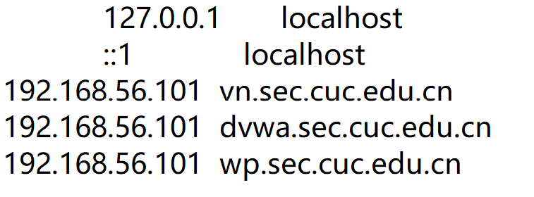
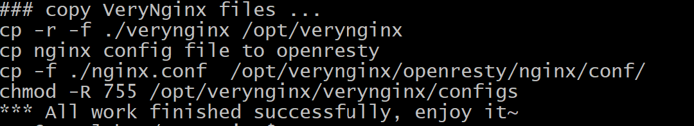
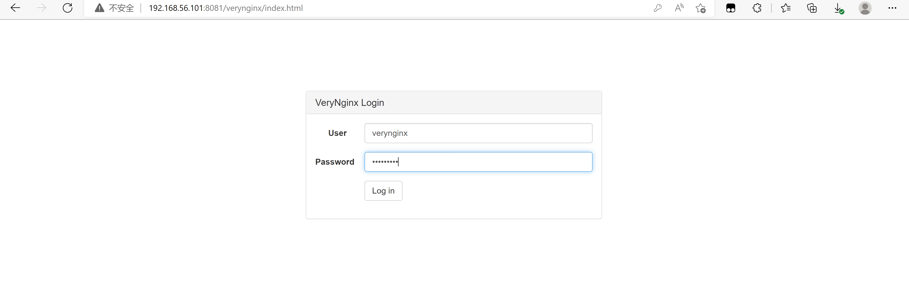
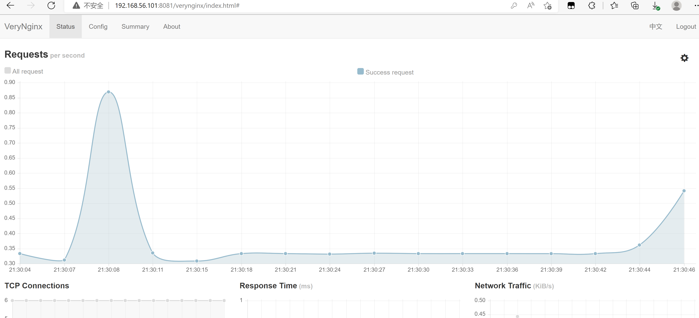
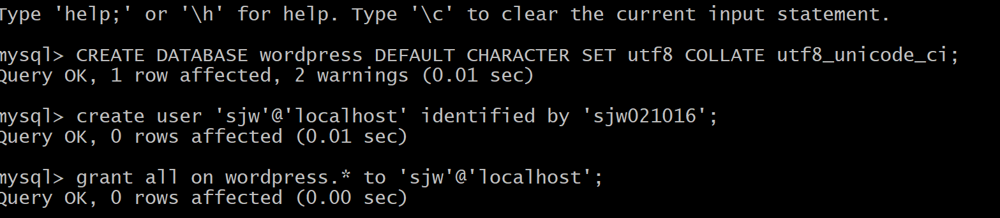
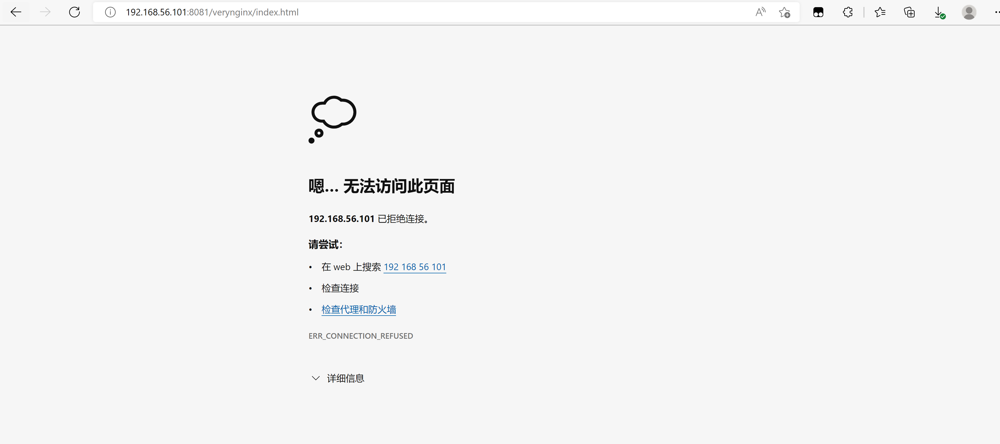

# 第五章：web服务器（实验）

---

## 实验环境

---

- Ubuntu 20.04 Server
- 软件环境
  - Nginx
  - VeryNginx
  - WordCompress 4.7 | [备用下载地址](https://github.com/WordPress/WordPress/archive/4.7.zip)

---

## 实验内容

---

### 1、实验检查点

- 在一台主机（虚拟机）上同时配置Nginx和VeryNginx
  - VeryNginx作为本次实验的Web App的反向代理服务器和WAF
  - PHP-FPM进程的反向代理配置在nginx服务器上，VeryNginx服务器不直接配置Web站点服务
- 使用Wordpress搭建的站点对外提供访问的地址为： http://wp.sec.cuc.edu.cn
- 使用Damn Vulnerable Web Application (DVWA)搭建的站点对外提供访问的地址为： http://dvwa.sec.cuc.edu.cn

### 2、安全加固要求

- 使用IP地址方式均无法访问上述任意站点，并向访客展示自定义的友好错误提示信息页面-1
- Damn Vulnerable Web Application (DVWA)只允许白名单上的访客来源IP，其他来源的IP访问均向访客展示自定义的友好错误提示信息页面-2
- 在不升级Wordpress版本的情况下，通过定制VeryNginx的访问控制策略规则，热修复WordPress < 4.7.1 - Username Enumeration
- 通过配置VeryNginx的Filter规则实现对Damn Vulnerable Web Application (DVWA)的SQL注入实验在低安全等级条件下进行防护

### 3、VeryNginx配置要求

- VeryNginx的Web管理页面仅允许白名单上的访客来源IP，其他来源的IP访问均向访客展示自定义的友好错误提示信息页面-3
- 通过定制VeryNginx的访问控制策略规则实现：
  - 限制DVWA站点的单IP访问速率为每秒请求数 < 50
  - 限制Wordpress站点的单IP访问速率为每秒请求数 < 20
  - 超过访问频率限制的请求直接返回自定义错误提示信息页面-4
  - 禁止curl访问

---

## 实验过程

- 更改主机hosts文件
```
#nginx
192.168.56.101 vn.sec.cuc.edu.cn
192.168.56.101 dvwa.sec.cuc.edu.cn
192.168.56.101 wp.sec.cuc.edu.cn
```

- 安装VeryNginx
```
# 克隆VeryNginx仓库
git clone https://github.com/alexazhou/VeryNginx.git
cd VeryNginx
# python3
sudo python3 install.py install
```

安装相关依赖包
```
# zlib
sudo apt-get install zlib1g-dev
# pcre
sudo apt-get update
sudo apt-get install libpcre3 libpcre3-dev
# gcc
sudo apt install gcc
# make
sudo apt install make
# penssl library
sudo apt install libssl-dev
```
安装成功


配置VeryNginx

```
# 修改 `/opt/verynginx/openresty/nginx/conf/nginx.conf` 配置文件
cd /opt/verynginx/openresty/nginx/conf/
sudo vim nginx.conf

#修改以下部分：

# 用户名
user  www-data;

# 监听端口
# 为了不和其他端口冲突，此处设置为8081
server {
        listen 192.168.56.101:8081;
        
        #this line shoud be include in every server block
        include /opt/verynginx/verynginx/nginx_conf/in_server_block.conf;

        location = / {
            root   html;
            index  index.html index.htm;
        }
    }
```
添加进程权限

```
chmod -R 777 /opt/verynginx/verynginx/configs
```
访问服务器的8081端口  
默认的用户名和密码`verynginx/verynginx` 进入http://192.168.56.101:8081/verynginx/index.html

登陆成功



- 安装Nginx
```
sudo apt install nginx
```
安装成功后默认在/opt/verynginx目录下进入nginx目录
```
sudo vim /etc/nginx/sites-enabled/default
```
部分配置文件的修改
```
root /var/www/html/wp.sec.cuc.edu.cn;
 # Add index.php to the list if you are using PHP
 index readme.html index.php;
 location ~ \.php$ {
 # include snippets/fastcgi-php.conf;
 #
 # # With php-fpm (or other unix sockets):
 fastcgi_pass unix:/var/run/php/php7.4-fpm.sock;
 fastcgi_index index.php;
 fastcgi_param SCRIPT_FILENAME $document_root$fastcgi_script_name;
 include fastcgi_params;
 # # With php-cgi (or other tcp sockets):
 # fastcgi_pass 127.0.0.1:9000;
 }
```
- WordPress的安装与配置
```
# 下载安装包
sudo wget https://wordpress.org/wordpress-4.7.zip

# 解压
# 已下载p7zip-full
7z x wordpress-4.7.zip

# 将解压后的wordpress移至指定路径
sudo mkdir /var/www/html/wp.sec.cuc.edu.cn
sudo cp wordpress /var/www/html/wp.sec.cuc.edu.cn

# 修改wp-config-sample中的内容，并更名为wp-config
sudo vim wp-config-sample
mv wp-config-sample wp-config
```
- php及相关组件
```
sudo apt install php-fpm php-mysql php-curl php-gd php-intl php-mbstring php-soap php-xml php-xmlrpc php-zip
```
- 下载mysql用于数据管理
```
#安装MySQL服务器
sudo apt-get install mysql-server
#查看MySQL版本
sudo mysql -V
#登录MySQL
sudo mysql
#建库
CREATE DATABASE wordpress DEFAULT CHARACTER SET utf8 COLLATE utf8_unicode_ci;
#新建用户
create user 'sjw'@'localhost' identified by 'sjw021016';
#授权
grant all on wordpress.* to 'sjw'@'localhost';
```

- 修改配置文件
```
#进入配置文件
sudo vim /var/www/html/wordpress/wp-config.php

// ** MySQL settings - You can get this info from your web host ** //
/** The name of the database for WordPress */
define('DB_NAME', 'wordpress');

/** MySQL database username */
define('DB_USER', 'username');

/** MySQL database password */
define('DB_PASSWORD', 'password');

/** MySQL hostname */
define('DB_HOST', 'localhost');

/** Database Charset to use in creating database tables. */
define('DB_CHARSET', 'utf8');

/** The Database Collate type. Don't change this if in doubt. */
define('DB_COLLATE', '');
```

- 安装DVWA
```
# 下载
git clone https://github.com/digininja/DVWA.git
# 建立目录
sudo mkdir /var/www/html/dvwa.sec.cuc.edu.cn
# 移动文件夹内容至该目录下
sudo mv DVWA/* /var/www/html/dvwa.sec.cuc.edu.cn
```


## 实验问题
- nginx.conf是一个只读文件,使用`sudo`
- 在进入http://192.168.56.101:8081/verynginx/index.html
时失败了，实验卡在了这里


- 通过查看讨论区马映雪的帖子找到解决方法
```
sudo /opt/verynginx/openresty/nginx/sbin/nginx
```
登陆成功


- Hosts是一个没有扩展名的系统文件，可以用记事本等工具打开，其作用就是将一些常用的网址域名与其对应的IP地址建立一个关联“数据库”，当用户在浏览器中输入一个需要登录的网址时，系统会首先自动从Hosts文件中寻找对应的IP地址，一旦找到，系统会立即打开对应网页，如果没有找到，则系统会再将网址提交DNS域名解析服务器进行IP地址的解析。

## 参考资料
- [etc/hosts](https://zhidao.baidu.com/question/166298321.html#:~:text=%E8%A7%A3%E5%86%B3%E5%8A%9E%E6%B3%95%E6%98%AF%EF%BC%9A%E5%9C%A8C%E7%9B%98%E6%90%9C%E7%B4%A2hosts%EF%BC%8C%E6%90%9C%E7%B4%A2%E5%87%BA%E6%9D%A5%E7%9A%84%E7%BB%93%E6%9E%9C%EF%BC%8C%E5%8F%B3%E9%94%AE%E6%89%BE%E5%88%B0hosts%E6%96%87%E4%BB%B6%E4%BD%8D%E7%BD%AE%EF%BC%8C%E6%9F%A5%E7%9C%8B%E6%96%87%E4%BB%B6%E5%86%85%E5%AE%B9%EF%BC%8C%E5%88%A4%E6%96%AD%E6%96%87%E4%BB%B6%E6%98%AF%E5%90%A6%E6%AD%A3%E5%B8%B8%EF%BC%8C%E5%86%8D%E6%8A%8Ahosts%E6%96%87%E4%BB%B6%E5%A4%8D%E5%88%B6%E5%88%B0%E6%A1%8C%E9%9D%A2%E4%B8%8A%E3%80%82,%E7%84%B6%E5%90%8E%E5%86%8D%E5%A4%8D%E5%88%B6%E7%B2%98%E8%B4%B4%E5%88%B0%E2%80%9CC%3A%5B%26WIN%26%5DDOWS%5B%26system%26%5D32%5B%26driv%26%5Ders%5B%26etc%26%5D%E2%80%9D%E9%87%8C%E9%9D%A2%E3%80%82)
- [linux_chap0x05](https://c4pr1c3.github.io/LinuxSysAdmin/chap0x05.exp.md.html#/2/1)